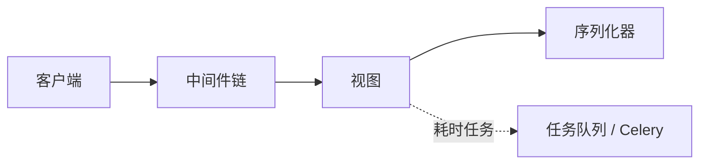

# Django 序列化、中间件与 Celery — 学习讲义

本讲义配合课程中的三个演示项目阅读与实践：

- `serializer_auto_demo` — 序列化（Django REST framework）
- `middleware_mixin_demo` — 中间件（`MiddlewareMixin` 执行顺序）
- `celery_async_demo` — 同步阻塞与异步任务（概念 + 阻塞演示）

建议在电脑上**跟着命令与 URL 自己跑一遍**，对照项目里的源码理解。

---

## 学习目标

| 主题 | 学完你可以 |
|------|------------|
| **序列化** | 说清「模型对象 → 可输出数据 → JSON」各自谁负责；能读懂 `ModelSerializer` 和 `SerializerMethodField` 的用法。 |
| **中间件** | 说清请求进入 Django 后大致经过哪些阶段；能根据打印结果判断多个中间件时 `process_request` / `process_view` / `process_response` 的顺序。 |
| **Celery** | 解释为什么耗时任务不适合一直放在 HTTP 请求里；知道 Task、Broker、Worker、`.delay()` 分别是什么。 |

---

## 1. 序列化：`serializer_auto_demo`

### 1.1 序列化在这里指什么？

在 Web API 里，**序列化**一般指：把 Python 里的对象（例如 Django 的 `Model` 实例、`QuerySet`）变成 **可以交给 HTTP 返回的数据结构**（通常是字典、列表等，再由框架转成 JSON）。

- **反序列化**：反过来，把客户端发来的 JSON 解析、校验，变成对象或写入数据库。本讲义重点在**出站**（返回给前端）。
- 使用 DRF 时，你通常**不用**在视图里手写 `json.dumps`，也**不用**自己逐个字段拼大字典；**序列化器**负责字段长什么样，**视图**负责取模型、调用序列化器、返回 `Response`。

### 1.2 数据怎么流？

以 `GET /api/books/` 为例：

1. 视图用 `Book.objects.all()` 从数据库取出 `QuerySet`。
2. `BookSerializer(queryset, many=True)` 把每条 `Book` 转成适合输出的基础类型（`many=True` 表示多条）。
3. `Response({ ..., "results": serializer.data })` 由 DRF 把 `serializer.data` 渲染成 JSON 响应。

### 1.3 项目里该看哪些文件？

| 文件 | 作用 |
|------|------|
| `bookstore/models.py` | `Book` 模型：书名、作者、价格、出版日期、是否推荐等。 |
| `bookstore/serializers.py` | `BookSerializer`：继承 `ModelSerializer`，在 `Meta.fields` 里列出对外字段；`display_title`、`stock_label` 用 `SerializerMethodField`，通过 `get_*` 方法生成**计算字段**（不必在数据库里多存一列）。 |
| `bookstore/views.py` | `book_list`、`book_detail`：取对象或 `QuerySet`，构造 `BookSerializer`，用 `serializer.data` 放进 `Response`。 |

### 1.4 请你动手

在项目根目录的 `serializer_auto_demo` 下（需已安装依赖、建好虚拟环境）：

```bash
cd serializer_auto_demo
python manage.py migrate
python manage.py runserver
```

浏览器或接口工具访问：

- `GET /api/` — 说明与端点列表  
- `GET /api/books/` — 图书列表  
- `GET /api/books/1/` — 单本书（若数据库里已有 id 为 1 的书）

**想一想**：如果要在 JSON 里多一个「展示用标签」，而不改数据库表结构，改**模型**还是改**序列化器**更合适？（提示：展示逻辑常放在 Serializer。）

### 1.5 小节

序列化器像是 API 的**对外形状说明书**：哪些字段出现、是否只读、是否要校验。视图尽量保持简单：**查数据 → 序列化 → `Response`**。

---

## 2. 中间件：`middleware_mixin_demo`

### 2.1 中间件是什么？

中间件是挂在 Django **处理请求与响应整条链路上**的组件。一个请求会依次经过多个中间件；视图执行完后，响应再依次经过这些中间件（具体经过哪些**钩子**，取决于你怎么写中间件类）。

常见用途：打日志、鉴权、安全头、统计耗时、限流等。

### 2.2 本项目用到的钩子（继承 `MiddlewareMixin`）

本项目中的中间件继承 `django.utils.deprecation.MiddlewareMixin`，并实现了：

| 方法 | 大致时机 |
|------|----------|
| `process_request(request)` | 请求进来后，可做处理（本演示里会打印日志）。 |
| `process_view(request, view_func, view_args, view_kwargs)` | 已经匹配到要调用的视图，**但视图函数还没执行**。 |
| `process_response(request, response)` | 视图已经返回了 `HttpResponse`，可以再改响应（本演示里会打印日志）。 |

（Django 还提供 `process_exception` 等，本仓库未演示。）

### 2.3 多个中间件时，顺序怎么记？

在 `settings.py` 里，`MIDDLEWARE` 列表**从上到下**是中间件的注册顺序。对本演示中的这套 `process_*`：

- **请求阶段**：`process_request`、`process_view` 都是 **先列表里的第一个，再第二个**（自上而下）。
- **响应阶段**：`process_response` 是 **先第二个，再第一个**（自下而上），像「先套上的外层后脱」。

环境变量 `MIDDLEWARE_DEMO_MODE` 控制演示模式：

- `single`：只启用 `SingleTraceMiddleware`。
- `multi`（默认）：`FirstTraceMiddleware` 在前，`SecondTraceMiddleware` 在后。

访问 `http://127.0.0.1:8000/demo/` 时，终端里应看到类似下面的输出（与你的 README 一致即可）。

**单个中间件：**

```text
[单个中间件] process_request
[单个中间件] process_view
[视图函数] demo_view
[单个中间件] process_response
```

**多个中间件：**

```text
[第一个中间件] process_request
[第二个中间件] process_request
[第一个中间件] process_view
[第二个中间件] process_view
[视图函数] demo_view
[第二个中间件] process_response
[第一个中间件] process_response
```

### 2.4 请你动手

```bash
cd middleware_mixin_demo

MIDDLEWARE_DEMO_MODE=single python manage.py runserver
# 浏览器打开 http://127.0.0.1:8000/demo/ ，看终端打印

# 停掉服务后换多中间件模式：
MIDDLEWARE_DEMO_MODE=multi python manage.py runserver
# 再访问同一地址，对比顺序
```

### 2.5 小节

中间件适合放**很多视图都要用到的横切逻辑**。顺序写错可能导致日志或鉴权顺序不符合预期。真实项目里还有框架自带的 Session、CSRF、安全相关中间件，自定义的一般按团队规范插在合适位置。

---

## 3. Celery 与耗时任务：`celery_async_demo`

### 3.1 这个演示项目在代码里演示什么？

`task_demo/views.py` 里有一个 `sleep_test_view`：在处理请求时执行 `time.sleep(3)`。这会让你**明显感到接口变慢**（大约 3 秒才返回）。它用来说明：

- 在**同步**处理模型下，这段时间里 Web 服务器的一个 worker 一直被占用；
- 并发多时，大量「慢请求」会明显影响能同时服务的请求数量。

**说明**：本仓库这一项目**主要用上面的接口演示「阻塞」**；完整接入 Celery（`celery.py`、Worker、Redis 等）可作为进阶练习，见下文「练习建议」。

### 3.2 Celery 里几个常用概念

| 名词 | 含义 |
|------|------|
| **Task（任务）** | 用装饰器注册的一个函数，可以被异步投递执行（例如 Django 里常用 `@shared_task`）。 |
| **Broker** | 消息队列中间件（常见如 Redis、RabbitMQ），用来存放「还没被执行的任务消息」。 |
| **Worker** | 独立进程，从 Broker 取任务并执行里面的代码。 |
| **调用方式** | Web 视图里通常调用 `某任务.delay(参数)`，会尽快返回**任务 id** 之类信息，**不**等于等任务跑完才返回页面。 |

可以记一句话：**Web 进程尽量快速响应；重活放到队列里由 Worker 慢慢做；Broker 负责在两者之间传递任务消息。**

### 3.3 若以后在 Django 里接 Celery，一般会看到什么？

- 项目里可能有 `celery.py`：创建 `Celery` 应用并从 Django 的 `settings` 读配置。
- `settings.py` 里配置 `CELERY_BROKER_URL` 等。
- 某个 `tasks.py` 里定义任务；视图里 `import` 后使用 `.delay()`。

具体安装与启动命令以你课程提供的文档为准。

### 3.4 请你动手

```bash
cd celery_async_demo
python manage.py runserver
```

浏览器访问：

`http://127.0.0.1:8000/task-demo/sleep-test/`

看 JSON 里的 `duration_seconds`，体会**整段等待都发生在这一次 HTTP 请求里**。再对照 3.2 思考：若把 `sleep(3)` 改成 Celery 任务在 Worker 里执行，用户这次请求通常可以**很快返回**（只负责「投递任务」）。

### 3.5 小节

- **序列化**：决定 API **数据长什么样**。  
- **中间件**：在请求进、响应出时做**横切**处理。  
- **Celery 这类方案**：把**耗时工作**从 HTTP 请求路径上挪走，改善吞吐与体验。

---

## 4. 三张图串起来（总览）



---

## 5. 常见问题（自学时可对照）

1. **序列化器里能用当前请求 `request` 吗？**  
   可以。视图传 `context={'request': request}` 时，在序列化器里可通过 `self.context['request']` 使用（例如按登录用户决定返回哪些字段）。

2. **为什么 `process_response` 是多中间件时倒序执行？**  
   与请求路径对称：先进入的中间件后参与响应处理，类似一层层「包洋葱」再一层层拆开。

3. **Celery 必须用 Redis 吗？**  
   不必须。Broker 也可以用 RabbitMQ 等；Redis 在学习与小型部署里很常见。

---

## 6. 练习建议（选做）

1. 在 `BookSerializer` 中增加一个只读字段（例如从 `published_date` 算出「出版年份」），用 `SerializerMethodField` 实现。  
2. 在中间件的 `process_response` 里给响应加一个自定义头（如 `X-Demo: 1`），用浏览器开发者工具或 `curl -I` 查看是否出现。  
3. **进阶**：为 `celery_async_demo` 增加最小 Celery 配置：定义一个执行 `sleep` 的任务，视图只调用 `.delay()` 并返回 `task_id`，另开终端启动 Worker 验证任务在后台执行。

---

*讲义内容与仓库中三个项目的 README 及源码一致；第三节 Celery 以概念与阻塞接口演示为主，完整 Celery 工程化以课堂或实验指导为准。*
