# 课程环境搭建指南（Windows）

> 重要：开课前请完成 `Python + uv`、`PyCharm`、`Git` 的安装。`nvm` 为可选项。

## 1. Python 环境（必做）

本课程不要求提前安装全局 Python，我们统一使用 `uv` 来管理 Python 和项目环境。这样能减少版本冲突，也能避免上课时因网络问题影响进度。

### 1.1 安装 uv

```powershell
# PowerShell 一键安装（推荐）
powershell -ExecutionPolicy ByPass -c "irm https://astral.sh/uv/install.ps1 | iex"
```

安装完成后，建议执行以下命令确认是否成功：

```powershell
uv --version
```

如果能看到版本号，说明 `uv` 安装成功。

### 1.2 常见报错处理

如果出现类似报错：
`文件“C:\Users\xxx\.local\bin\uv.exe”正由另一进程使用，因此该进程无法访问此文件。`

可执行：

```powershell
taskkill /F /IM uv.exe
```

然后重新执行安装命令即可。

### 1.3 初始化一个项目

1. 新建一个空文件夹。
2. 在该文件夹中打开终端，执行：

```powershell
uv init
```

执行完成后，一个基础的 Python 项目就搭建好了。`uv` 的更多命令会在课上详细讲解。

## 2. IDE（PyCharm）

为了统一开发体验，课程默认使用 `PyCharm` 作为 IDE。

- 当前阶段使用社区版（免费）即可。
- 到 Django 阶段后，建议升级为专业版，以获得更完整的 Web 开发支持。

### 2.1 升级为专业版的方式

1. 使用学生证或录取通知书到 JetBrains 官方申请学生认证。
2. 使用学生邮箱申请学生权益。
3. 如果前两种方式都不方便，可在群里私信助教李宇航获取替代方案（课上不展开说明）。

## 3. Git 安装（必做）

`Git` 和 `uv` 一样，当前阶段只要求先完成安装，具体操作会在课程中实操。

官网地址：
- https://git-scm.com/
- https://github.com/git-for-windows/git/releases

推荐版本：`Git 2.40.0`

### 3.1 安装步骤（按默认配置即可）

1. 查看 GNU 协议，直接点击下一步。  
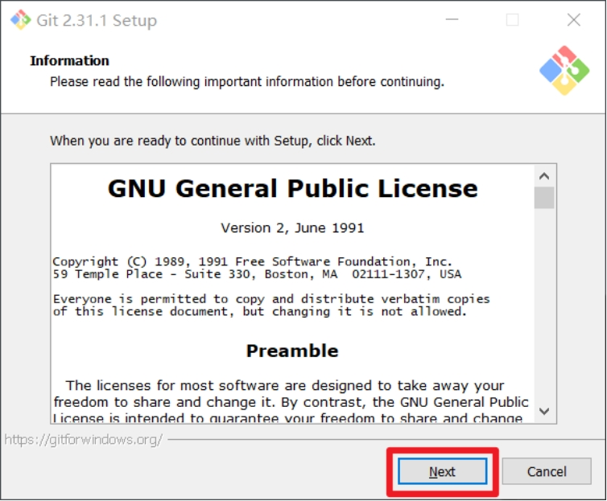

2. 选择 Git 安装位置（建议非中文且无空格目录），然后下一步。  
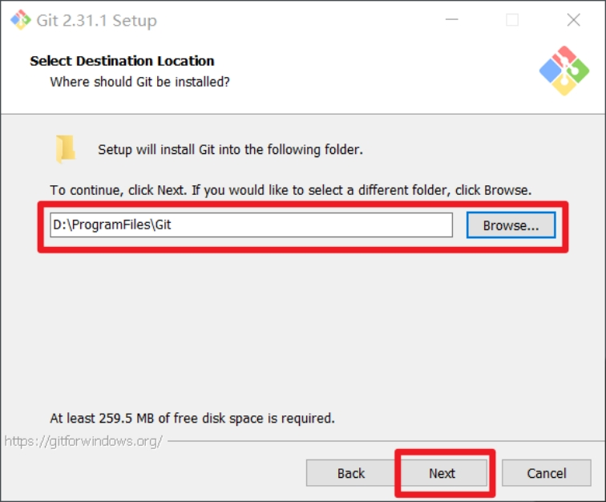

3. Git 选项配置，保持默认设置，下一步。  
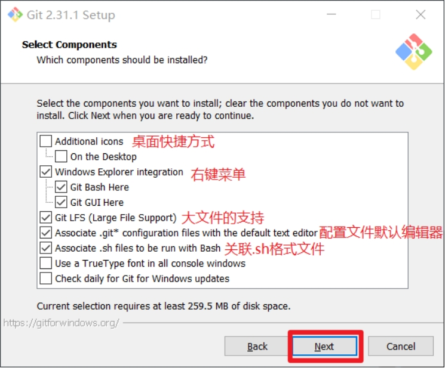

4. Git 安装目录名保持默认，直接下一步。  
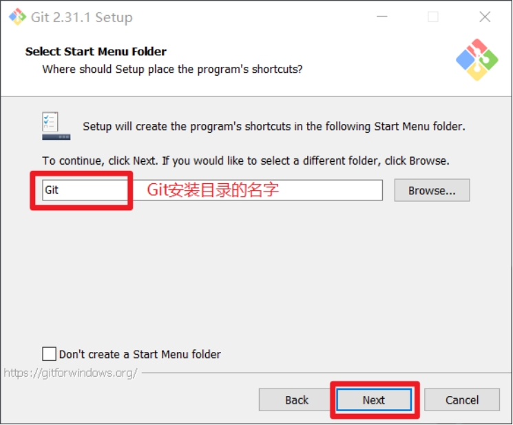

5. 默认编辑器建议使用 Vim（默认值），然后下一步。  
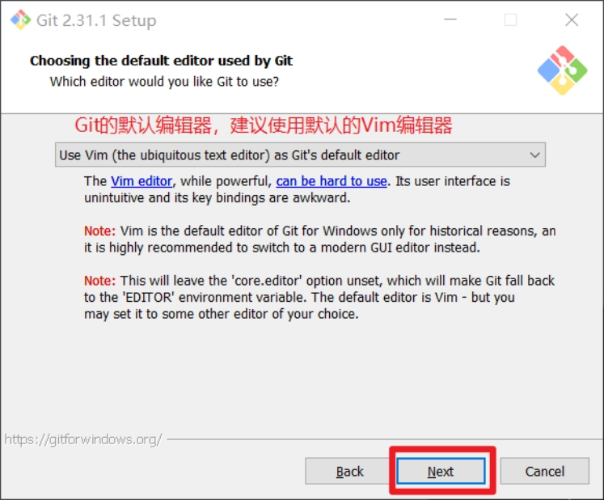

6. 默认分支名设置保持默认（Let Git decide），下一步。  
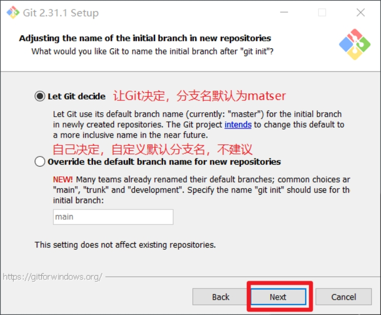

7. 环境变量配置选择第一项（仅在 Git Bash 中使用 Git），下一步。  
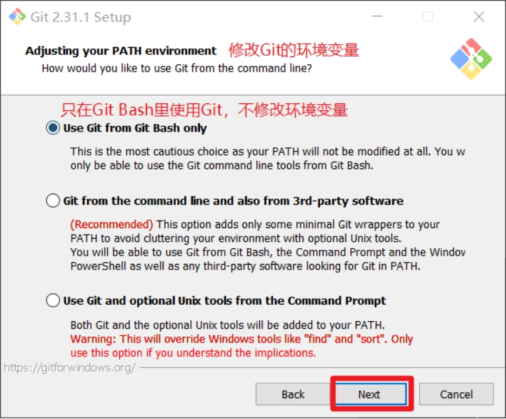

8. 后台客户端连接协议选择默认 OpenSSL，下一步。  
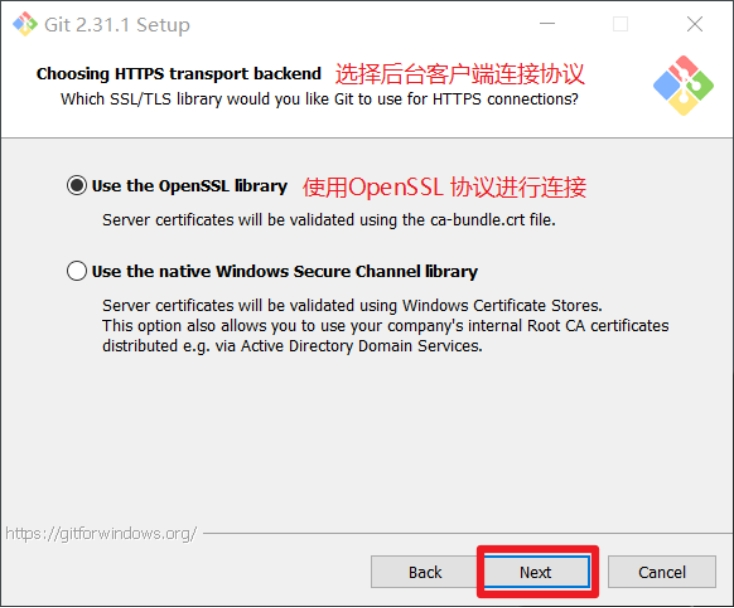

9. 行尾换行符设置选择第一项（自动转换），下一步。  
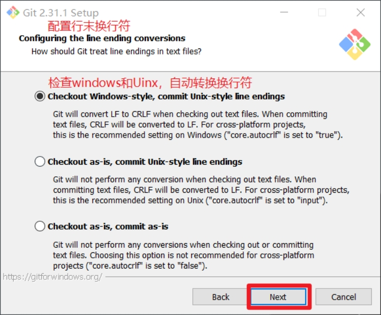

10. 终端类型选择默认 Git Bash，下一步。  
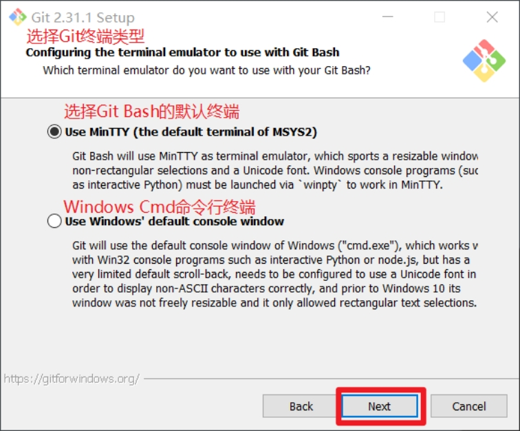

11. `git pull` 合并模式选择默认，下一步。  
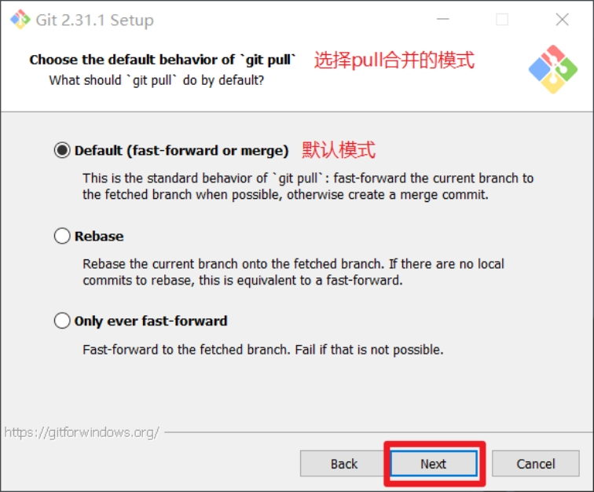

12. 凭据管理器选择默认跨平台管理器，下一步。  
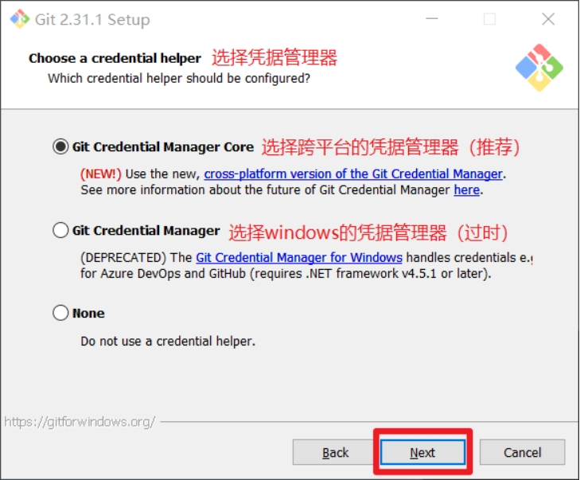

13. 其他配置保持默认，下一步。  
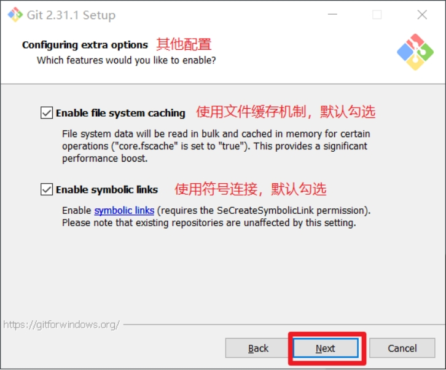

14. 实验性功能不勾选，点击右下角 `Install` 开始安装。  
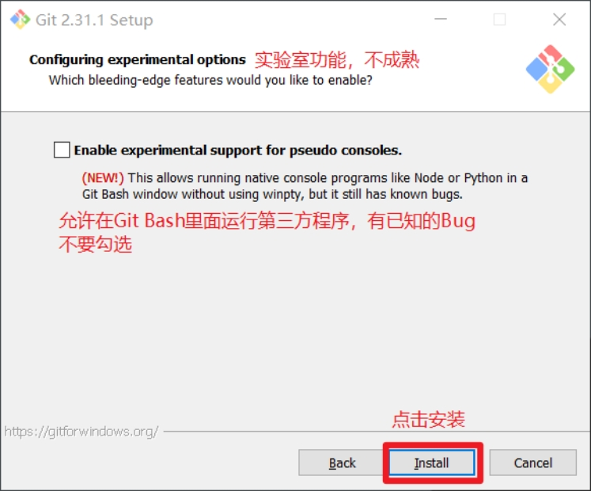

15. 点击 `Finish`，完成安装。  
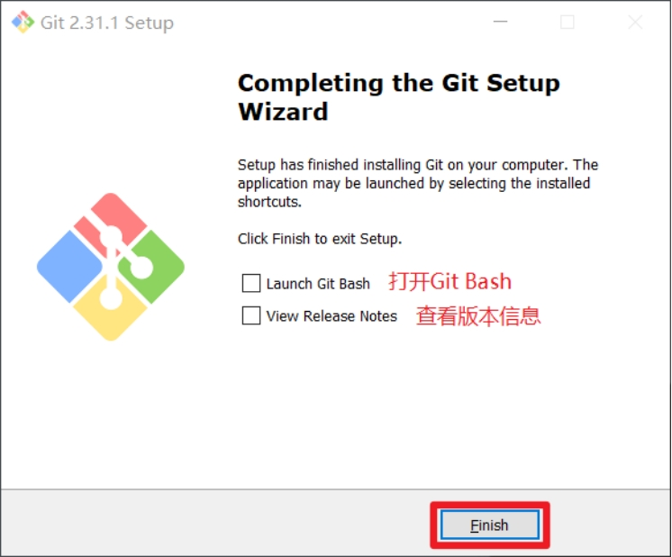

### 3.2 安装完成验证

1. 在任意目录右键，选择 `Git Bash Here` 打开终端。  
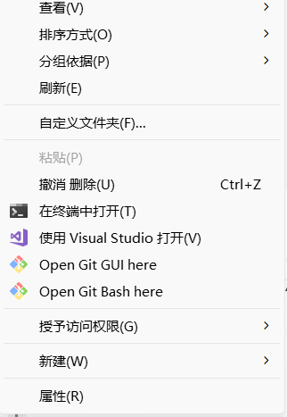

2. 在 Git Bash 中执行：

```bash
git --version
```

若能看到版本号，说明 Git 安装成功。  
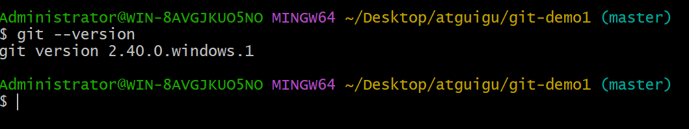

## 4. nvm 安装（可选）

如果你当前时间比较紧，可以先跳过 `nvm`。该工具会在 Django 最后一节课用到。

参考教程：
[nvm 安装教程（Windows）](https://www.freecodecamp.org/chinese/news/nvm-for-windows-how-to-download-and-install-node-version-manager-in-windows-10/)

简化结论：安装过程中基本保持默认，按提示下一步即可。
